# Домашнее задание 1: Обработка и анализ изображений
#### Цель: Применить базовые методы обработки изображений для улучшения качества и выделения ключевых признаков.

**Выполнил Михайлов Алексей**

---
**Задание 1. Загрузка и отображение изображения:**
* Выберите цветное изображение по вашему выбору (например, природа, архитектура, портрет).
* С помощью библиотек OpenCV или PIL загрузите изображение в программу.
* Отобразите исходное изображение.

Загружу фотографию c `Nikon comedy wildlife photography awards 2024`

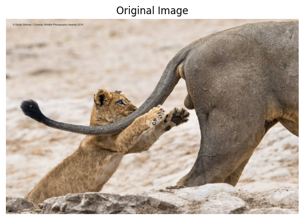

**Задание 2. Преобразование цветовых пространств:**
* Преобразуйте изображение из RGB в Grayscale и HSV.
* Отобразите каждое из полученных изображений.
* Постройте гистограммы яркости для исходного и серого изображений.

Здесь всё просто:

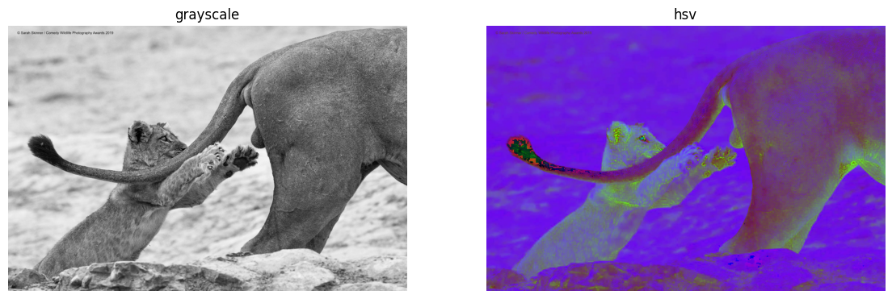

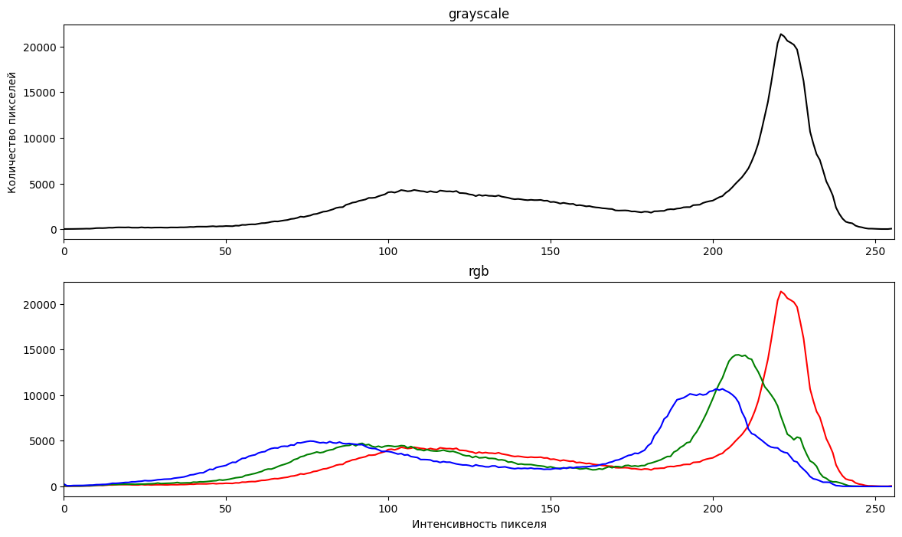

**Задание 3. Фильтрация изображений:**
* Примените к серому изображению следующие фильтры:
    * Гауссово сглаживание с разными значениями σ (сигма).
    * Медианный фильтр с разными размерами ядра.
    * Фильтр Лапласа для повышения резкости.
* Отобразите результаты фильтрации и сравните их визуально.

После сглаживания фильтр Лапласа находит более четки границы, соответственно сможет лучше поднять резкость. Я не стал сумировать изображения, результат фильтра демонстрирует разницу между блюрами лучше. 

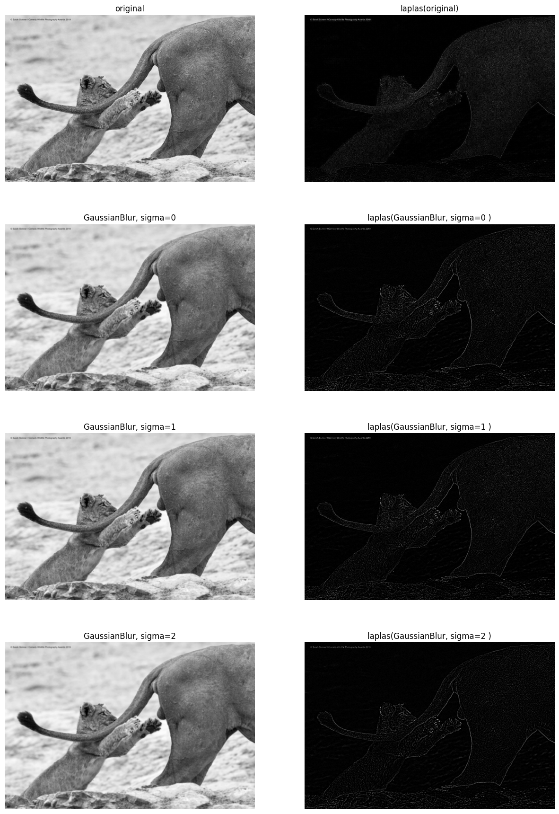

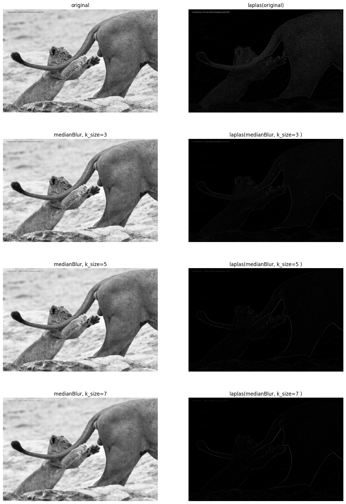

Видно, что фильтр Лапласа на ориганльном изображении находит очень много мелких деталей, которые скорее добавят шума, чем резкости, когда при применении блюра получается находить именно границы. При этом размытие Гауса дает более четкие границы. 

**Задание 4. Выделение краев и углов:**
* Используйте оператор Собеля для определения горизонтальных и вертикальных градиентов.
* Примените алгоритм Кэнни для обнаружения краев.
* Используйте детектор углов Harris или Shi-Tomasi для выявления угловых точек.
* Наложите результаты на исходное изображение и отобразите.

Собель:

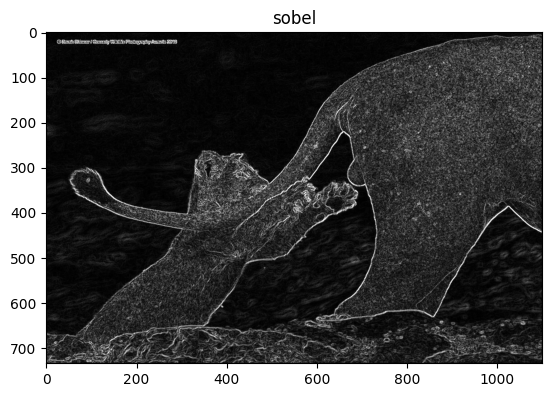

Канни:

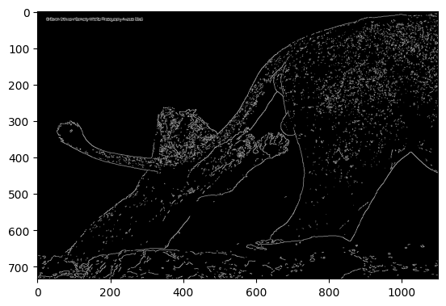

Углы Харрис:

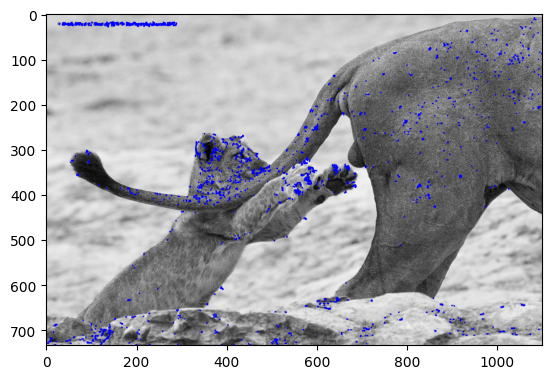

Канни и Харис на оригинальном изображении:

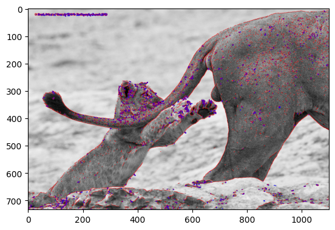

**Задание 5. Морфологические операции:**
* Бинаризуйте серое изображение с помощью пороговой сегментации.
* Примените операции эрозии и дилатации с различными структурными элементами.
* Отобразите результаты и объясните эффект каждой операции.

Переводим картинку к бинарному виду: 

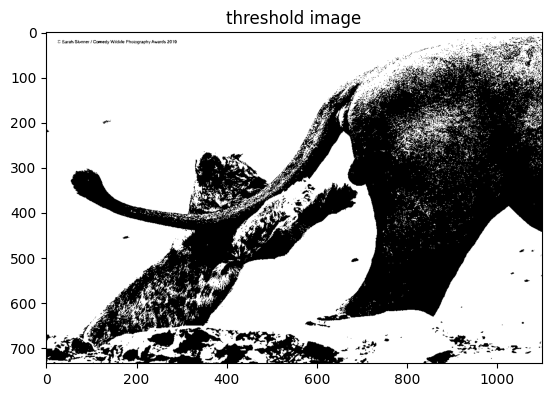

Применяем эрозию, которая "съедает" белый мелкий шум:

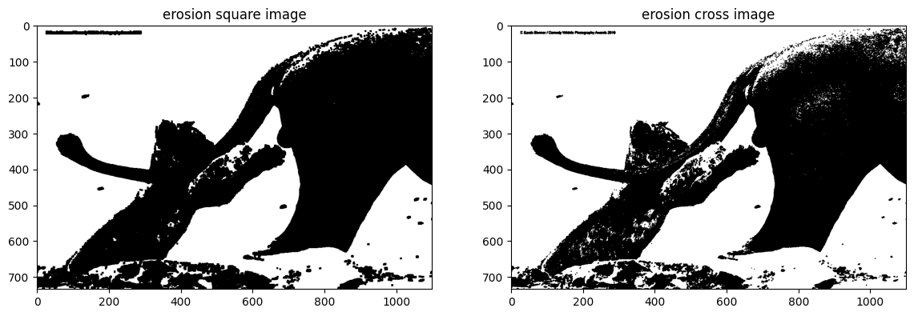

Применяем Делитацию, котороая "съедает" темный шум:

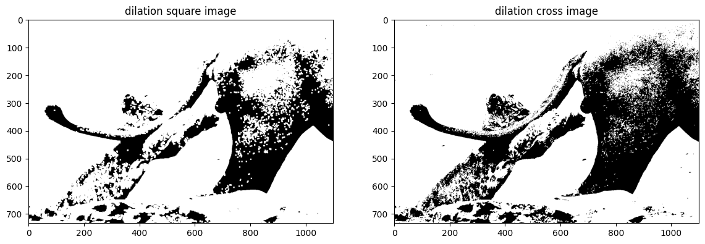

Эрозия "съедает" "белый" шум расширяя темные объекты, а делитация "съедает" темные объекты и заполняет "темный" шум. 

Если объединить их, то можно получить изображения с более четкими ганицами объектов. 

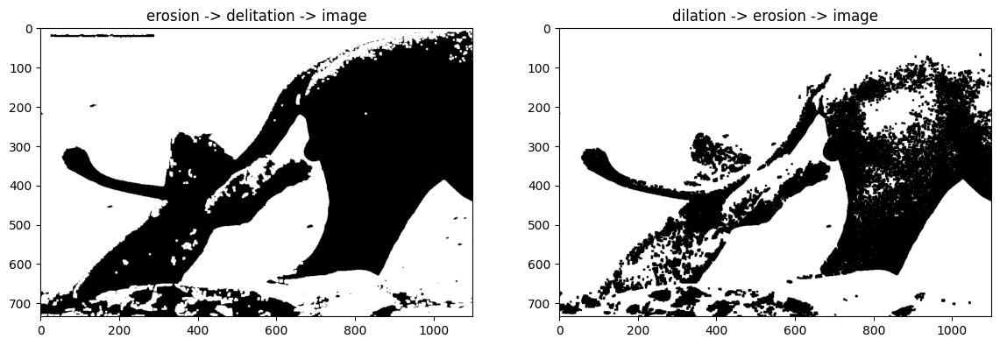